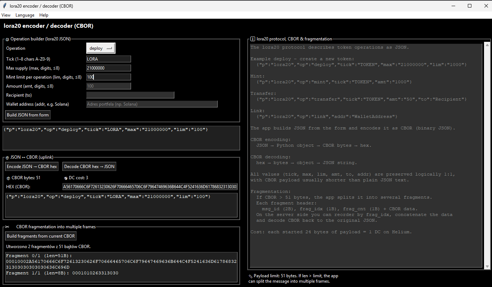
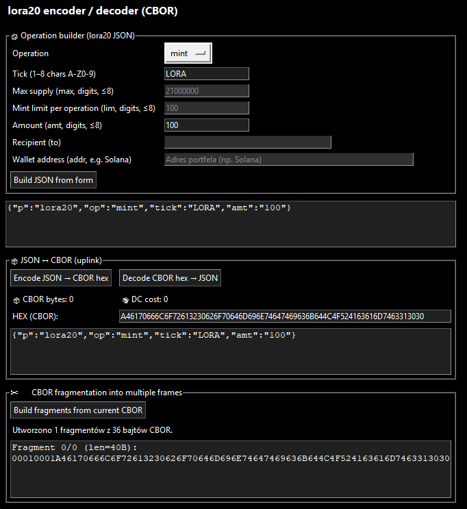
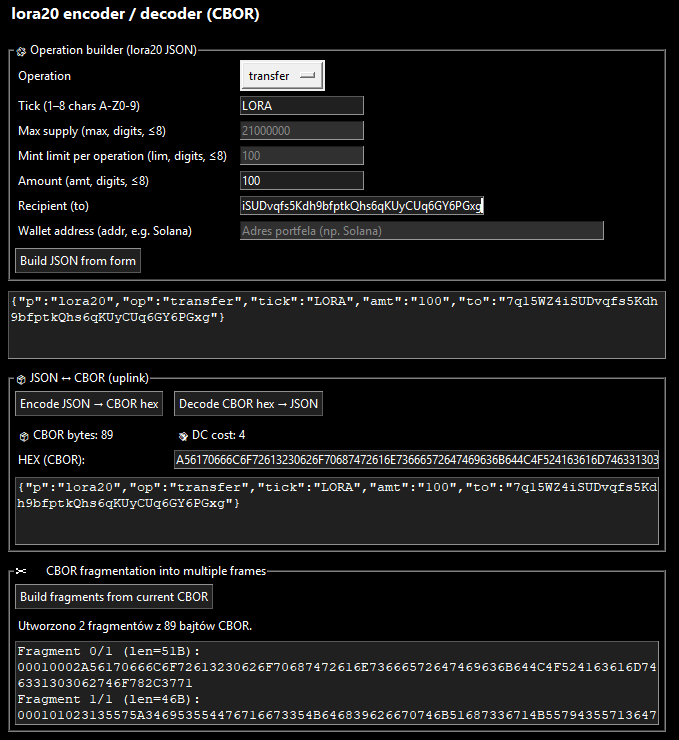
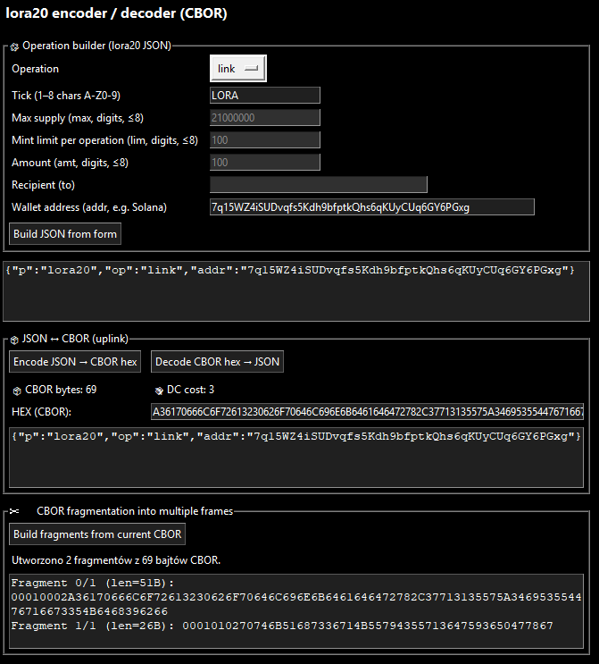
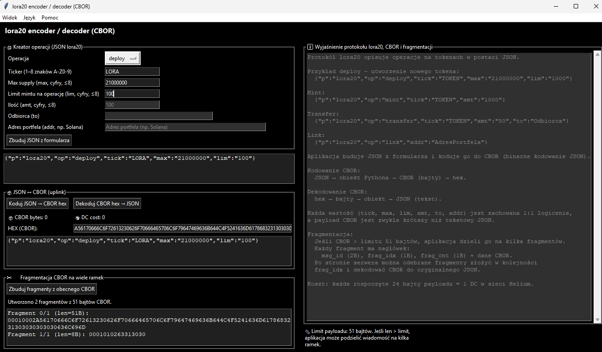
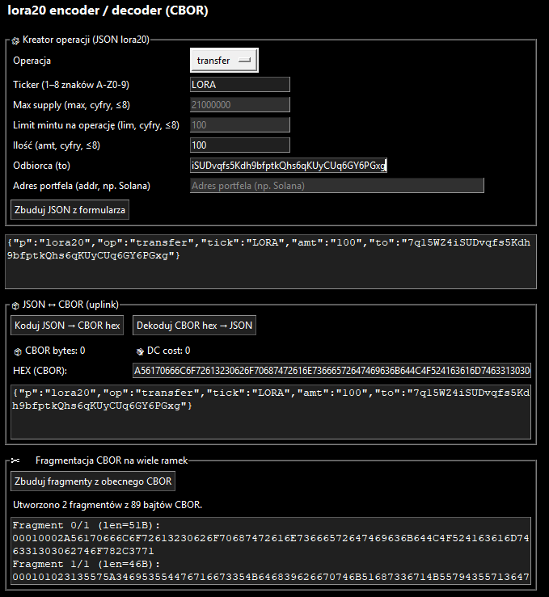
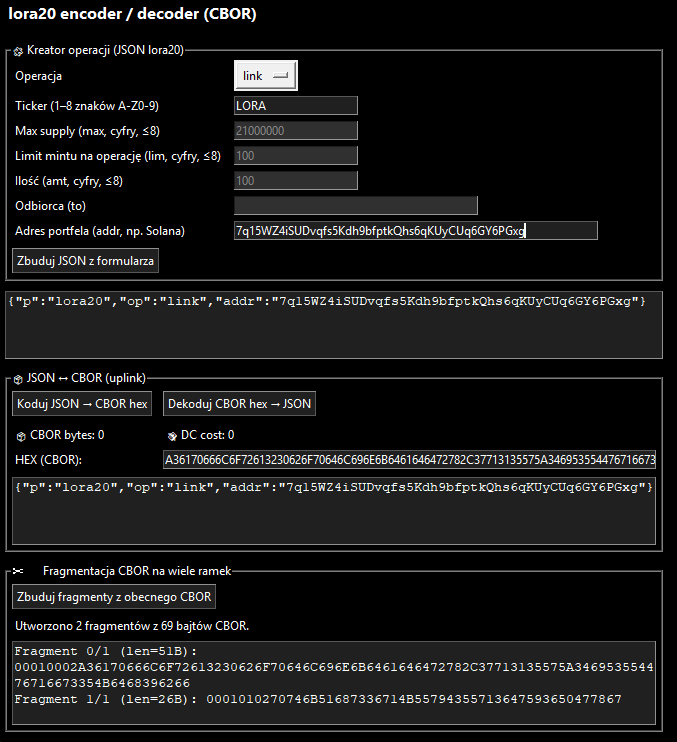

# 🚀 lora20 GUI

> Simple Tkinter app for building lora20 operations, CBOR encoding/decoding, and payload fragmentation for Helium / LoRaWAN.

---

## 🌍 Languages
- 🇬🇧 English (default)
- 🇵🇱 Polski → [Przejdź do sekcji polskiej](#-polski)

---

## 📥 Download
[](https://github.com/hattimon/lora20/releases/tag/v1.0.0)

---

## ✨ Features

### 🧱 Deploy

Create new lora20 token definitions.

### 🪙 Mint

Mint tokens based on deployed contract.

### 🔄 Transfer

Transfer tokens between addresses.

### 🔗 Link

Link metadata or references to operations.

---

### ⚙️ Core Functionality
- JSON → CBOR (hex) encoding
- CBOR → JSON decoding
- DC cost calculation *(every started 24 bytes = 1 DC)*
- Payload fragmentation *(51B limit, 4B header)*
- Light / Dark mode
- Multi-language support (EN / PL)
- User settings persistence

---

## 📦 Requirements
- Python 3
- Tkinter
- `cbor2`
- *(optional)* `appdirs`

---

## 🔧 Installation
```bash
py -m pip install cbor2 appdirs
```

---

## ▶️ Run
```bash
py lora20_gui.py
```

---

## 🏗️ Build EXE (Windows)
```bash
py -m pip install pyinstaller
py -m PyInstaller lora20_gui.spec
```

Output will be available in:
```
dist/lora20_gui
```

---

## ⚙️ Settings
Settings file is stored in:
- User data directory (via `appdirs`)
- or fallback: `~/.lora20_gui/settings.json`

---

# 🇵🇱 Polski

## 📥 Pobieranie
[](https://github.com/hattimon/lora20/releases/tag/v1.0.0)

---

## ✨ Funkcje

### 🧱 Deploy

Tworzenie nowych definicji tokenów lora20.

### 🪙 Mint

Mintowanie tokenów na podstawie kontraktu.

### 🔄 Transfer

Transfer tokenów między adresami.

### 🔗 Link

Łączenie metadanych lub referencji.

---

### ⚙️ Główne możliwości
- Kodowanie JSON → CBOR (hex)
- Dekodowanie CBOR → JSON
- Obliczanie kosztu DC *(każde rozpoczęte 24 bajty = 1 DC)*
- Fragmentacja payloadu *(limit 51B, nagłówek 4B)*
- Motyw jasny / ciemny
- Obsługa wielu języków (EN / PL)
- Zapisywanie ustawień użytkownika

---

## 📦 Wymagania
- Python 3
- Tkinter
- `cbor2`
- *(opcjonalnie)* `appdirs`

---

## 🔧 Instalacja
```bash
py -m pip install cbor2 appdirs
```

---

## ▶️ Uruchomienie
```bash
py lora20_gui.py
```

---

## 🏗️ Budowa EXE (Windows)
```bash
py -m pip install pyinstaller
py -m PyInstaller lora20_gui.spec
```

Plik wynikowy znajdziesz w:
```
dist/lora20_gui
```

---

## ⚙️ Ustawienia
Plik ustawień zapisywany jest w:
- katalogu danych użytkownika (`appdirs`)
- lub: `~/.lora20_gui/settings.json`

---

## ⭐ Support
If you like this project, consider giving it a ⭐ on GitHub!

